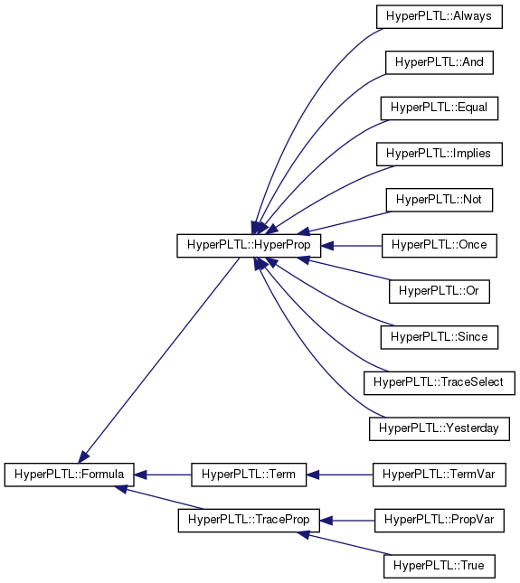

## Build instructions

* Installing dependencies

  ```bash
  sudo ./setup.sh
  ```

- Debug build [ *default* ]

  ```bash
  mkdir build
  cd build
  cmake ..
  make
  ```

- Release build

  ```bash
  mkdir build
  cd build
  cmake .. -DCMAKE_BUILD_TYPE=Release
  make
  ```

- Running tests in build directory

  ```bash
  make test
  ```
- Running tests individually in build directory
  ```bash
  ./bin/testlibprop --gtest_filter="[TEST_NAME]"
  ```
  e.g. <code>./bin/testlibprop --gtest_filter="PropertyLibTest.ValidTraceNotOperator"</code>

## Property Specification

 + Temporal operators
    - G, Y, O, S
 + Relational operator
    - EQ
 + Logical operators
    - NOT, AND, OR, IMPLIES

##### Notes
- EQ is applied to a TermVar only e.g `(EQ x)`
- Rest of the operators take inputs of type HyperProp
- Parser is <span style="color:maroon">case sensitive </span> :warning:. All <span style="color:blue">keywords should be in capital case</span> in the formula and paranthesis should be put appropriately. Please refer to the grammar or examples below.

**Grammar**
```
varexpr :=  lparen >>
                (   not_expr
                    | or_expr
                    | and_expr
                    | implies_expr
                    | gexpr
                    | yespr
                    | oexpr
                    | sexpr
                )
            >> rparen

not_expr        := "NOT" >> termexpr
or_expr         := "OR" >> termexpr >> termexpr
and_expr        := "AND" >> termexpr >> termexpr
implies_expr    := "IMPLIES" >> termexpr >> termexpr
gexpr           := "G" >> termexpr
yexpr           := "Y" >> termexpr
oexpr           := "O" >> termexpr
sexpr           := "S" >> termexpr

termexpr        := varexpr
                    | (lparen >> eqlexpr >> rparen)
                    | selexpr

eqlexpr         := "EQ" >> identifier
selexpr         := identifier >> "." >> uint
identifier      := ([a-z A-Z]) >> *([a-z A-Z 0-9])
lparen          := "("
rparen          := ")"
```

**Some examples**
1. (S (EQ y) (EQ x))
2. (G (OR (EQ x) (EQ y)))

## Inheritance diagram



[(complete class diagram)](https://github.com/tgourav/fuzztest/blob/master/libprop/doc/class_hyper_p_l_t_l_1_1_formula__inherit__graph.png)
